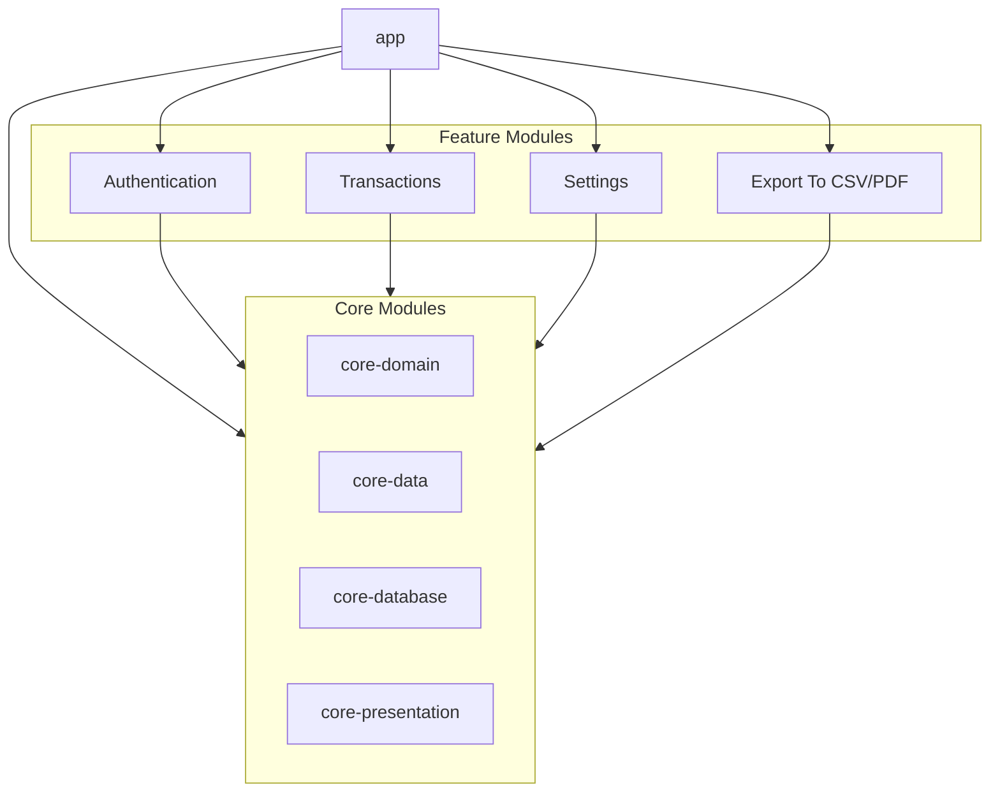

# SpendLess

<p align="center">
  
</p>

<p align="center">
  A secure finance tracking app that helps you manage income and expenses while keeping your data safe.
</p>

<p align="center">
  
  
  
  
</p>

## Table of Contents

- [Features](#features)
- [Screenshots](#screenshots)
- [Architecture](#architecture)
- [Tech Stack & Libraries](#tech-stack--libraries)
- [Module Design](#module-design)
- [Module Dependencies](#module-dependencies)
- [Module Structure](#module-structure)
- [Project Structure](#project-structure)
- [Getting Started](#getting-started)
- [Impact of Modular Architecture](#impact-of-modular-architecture)
- [Acknowledgments](#acknowledgments)

## Features

- **Secure Sessions:** Uses a 5-minute default session with a PIN prompt and optional biometrics for secure access.
- **Account Management:** Create accounts with a username and a 5-digit PIN (encrypted for security).  
- **Transaction Management:** Easily track income and expenses. All transactions are encrypted and displayed according to user-defined formatting.
- **Custom Preferences:** Set your currency symbol, decimal and thousands separators, and expense formatting options.
- **Robust Error Handling:** Includes visual red error banners for failed logins, incorrect PIN entries, and duplicate username issues.
- **Data Export:** Export your transaction history to CSV (or PDF in extended versions) for record-keeping.

## Screenshots

<p align="center">
  
  
  
</p>

## Architecture

SpendLess is built with a clean, modular architecture that emphasizes security, maintainability, and ease of development. Key architectural highlights include:

- **Modular Design:** Each feature (e.g., Authentication, Transactions, Settings) is developed in its own module, ensuring clear separation of concerns.
- **Clean Architecture:** Follows clean architecture principles with distinct layers for data, domain, and presentation.
- **Secure Data Handling:** All transaction data and PINs are encrypted before local storage.
- **Session Management:** A secure session management system that handles session expiration and re-authentication via PIN or biometrics.

## Tech Stack & Libraries

- Minimum SDK level 25
- Modern Development
  - [Kotlin](https://kotlinlang.org/) + [Coroutines](https://github.com/Kotlin/kotlinx.coroutines) + [Flow](https://kotlin.github.io/kotlinx.coroutines/kotlinx-coroutines-core/kotlinx.coroutines.flow/)
  - [Jetpack Compose](https://developer.android.com/jetpack/compose) for modern UI development
  - [Koin](https://insert-koin.io/) for dependency injection
- Architecture Components
  - Room for local database
  - Lifecycle components
  - Navigation Compose
  - WorkManager for background tasks
- Networking & Data
  - [Ktor Client](https://ktor.io/docs/client.html) for network operations
  - [Kotlinx.serialization](https://github.com/Kotlin/kotlinx.serialization) for JSON parsing
- UI Components
  - [Material Design 3](https://m3.material.io/) components
  - [Coil](https://coil-kt.github.io/coil/) for image loading
- Testing & Debugging
  - JUnit for unit testing
  - [LeakCanary](https://square.github.io/leakcanary/) for memory leak detection
  - [Timber](https://github.com/JakeWharton/timber) for logging

## Module Design

SpendLess uses a modular approach to organize its codebase effectively:

| Module         | Type               | Description |
|----------------|--------------------|-------------|
| `app`          | Application Module | Main entry point and dependency orchestration |
| `auth`         | Feature Module     | User authentication, PIN prompt, and biometric integration |
| ├── data      | Android/iOS Library| Handles authentication data sources and API integration |
| ├── domain    | Shared Library     | Business logic for login, registration, and session management |
| └── presentation | UI Module       | Authentication screens and view models |
| `core` | Core | Shared core functionality used across all modules |
| ├── data | Android Library | Common data handling utilities and shared repositories |
| ├── database | Android Library | Room database implementation and data persistence |
| ├── domain | Kotlin Library | Core business models and base classes |
| └── presentation | Android Library | Shared UI components and utilities |
| &nbsp;&nbsp;&nbsp;&nbsp;├── designsystem | Android Library | Design system implementation, themes, and reusable UI components |
| &nbsp;&nbsp;&nbsp;&nbsp;└── ui | Android Library | Common UI utilities and extensions |
| `transactions` | Feature Module     | Managing, creating, and displaying transactions |
| `settings`     | Feature Module     | User preferences, session settings, and security configurations |
| `export`       | Feature Module     | Data export functionality (CSV/PDF) |

### Module Dependencies

Each module follows these dependency rules:
- Feature modules only depend on `core` modules
- Presentation layers depend on domain layers
- Domain layers depend on data layers
- Data layers implement domain interfaces
- No feature module depends directly on another feature module
- Communication between features is handled through the core module

## Module Structure



## Project Structure
```
spendless/
├── app/
├── auth/
│   ├── data/
│   ├── domain/
│   └── presentation/
├── core/
│   ├── data/
│   ├── database/
│   ├── domain/
│   └── presentation/
│       ├── designsystem/
│       └── ui/
├── transactions/
│   ├── data/
│   ├── domain/
│   ├── network/
│   └── presentation/
├── settings/
│   ├── data/
│   ├── domain/
│   └── presentation/
└── export/
    ├── data/
    ├── domain/
    └── presentation/
```

## Getting Started

1. Clone the repository
```bash
git clone https://github.com/IronManYG/spendless.git
```

2. Open with Android Studio
3. Sync project with Gradle files
4. Run the app
   
## Impact of Modular Architecture

The modular architecture of Maktabati provides several key benefits across different aspects of development:

1. **Development Workflow**
   - Enables parallel development of features (Auth, Transactions, Export, etc.)
   - Reduces merge conflicts through clear module boundaries
   - Allows different teams to work independently on separate features
   - Facilitates easier code reviews with focused changes

2. **Build Performance**
   - Improves build times through parallel module compilation
   - Enables incremental builds for faster development
   - Reduces compilation scope during development
   - Supports better Gradle build cache utilization

3. **Testing Strategy**
   - Enforces better test isolation by module
   - Enables focused testing of specific features
   - Allows parallel test execution
   - Supports comprehensive integration testing between modules

4. **Maintenance & Scalability**
   - Clear separation of concerns between features
   - Easier to identify and fix issues within specific modules
   - Simplified dependency management
   - Better code organization and navigation

5. **Feature Development**
   - Each feature (Auth, Transactions, Export, etc.) can be developed and tested independently
   - Clear boundaries between different app functionalities
   - Easier to add new features without affecting existing ones
   - Supports potential dynamic feature delivery in the future

6. **Team Collaboration**
   - Clear ownership of different modules
   - Reduced code conflicts between teams
   - Better code organization for new team members
   - Easier onboarding process
  
## Acknowledgment

This project was built as part of the **[Pl Mobile Dev Campus](https://pl-coding.com/campus/)** community challenge.

**Thank you for checking out SpendLess!**

If you have any questions or suggestions, feel free to open an issue or reach out to the maintainer. Happy coding!

